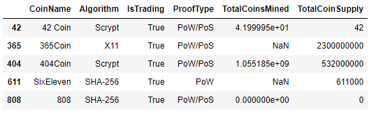
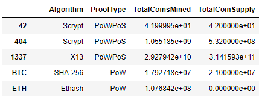
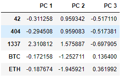
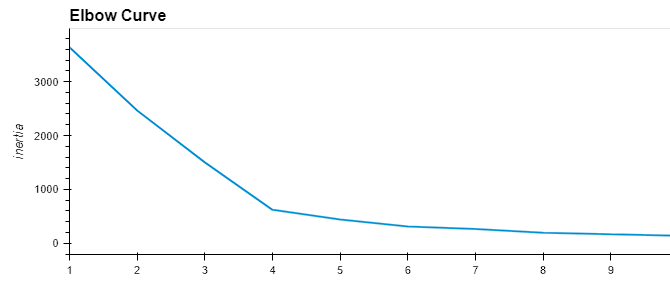
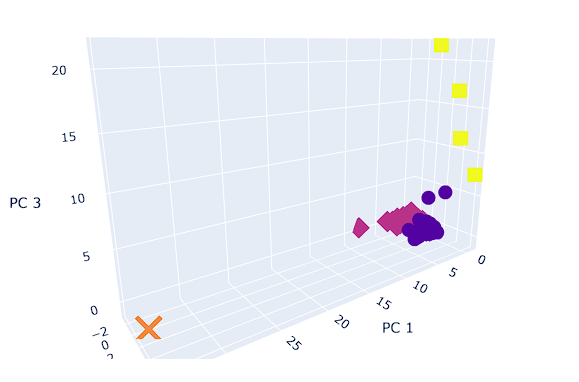
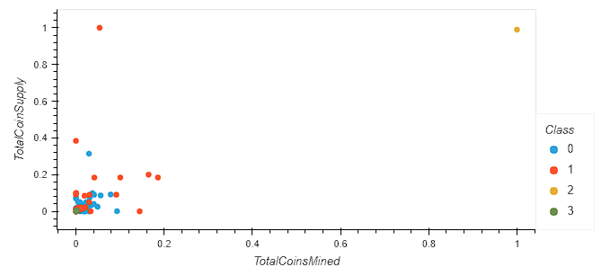

# Cryptocurrencies
## Overview
This project explores unsupervised machine learning using Sci-Kit learn's varius libraries. Utilizing a crtyptocurrency dataset, we will use unsupervised machine learning to cluster cryptocurrencies using the KMeans algorithm. 

## Resources
Data: Cryptocurrency Data
Software: Visual Studio Code 1.72.1, Jupyter Notebook 6.4.8, Python 3.7.13  
Libraries: [Pandas](https://pandas.pydata.org/docs/), [Plotly](https://plotly.com/python/), [Sci-Kit Learn](https://scikit-learn.org/stable/)

## Results

> Original Dataset

> Preprocessed Dataset

> PCA Dataset

> Elbow Curve

> Clustered KMeans Data

> Cryptocurrencies

## Summary